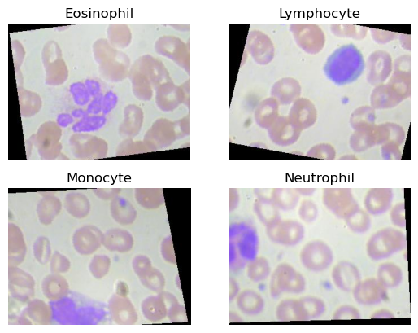
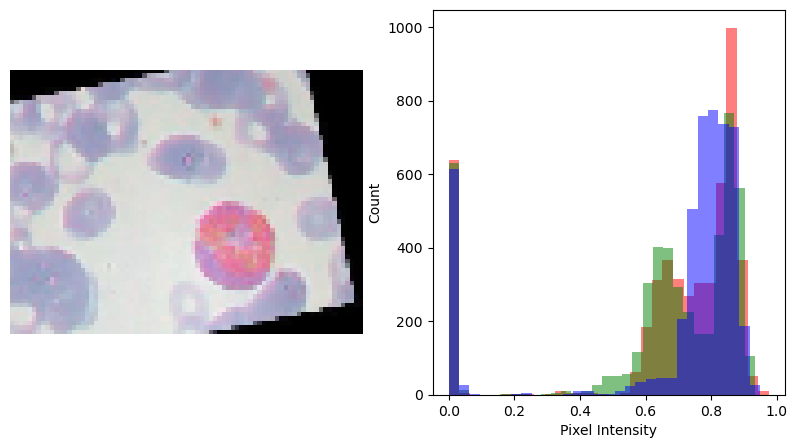
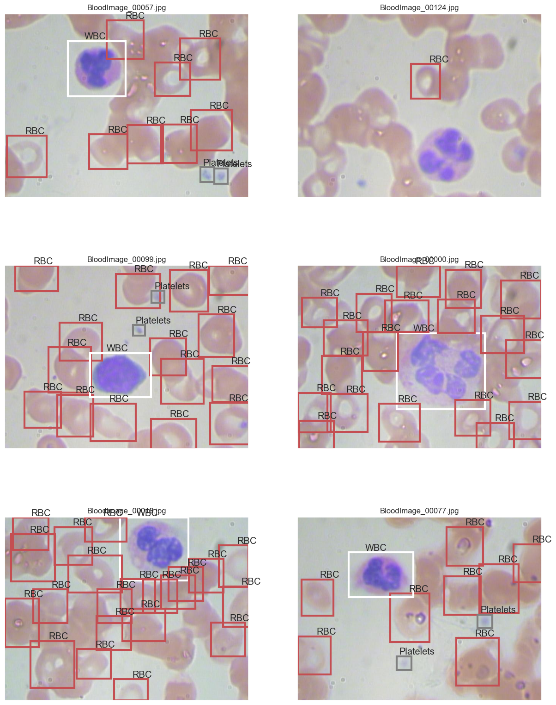
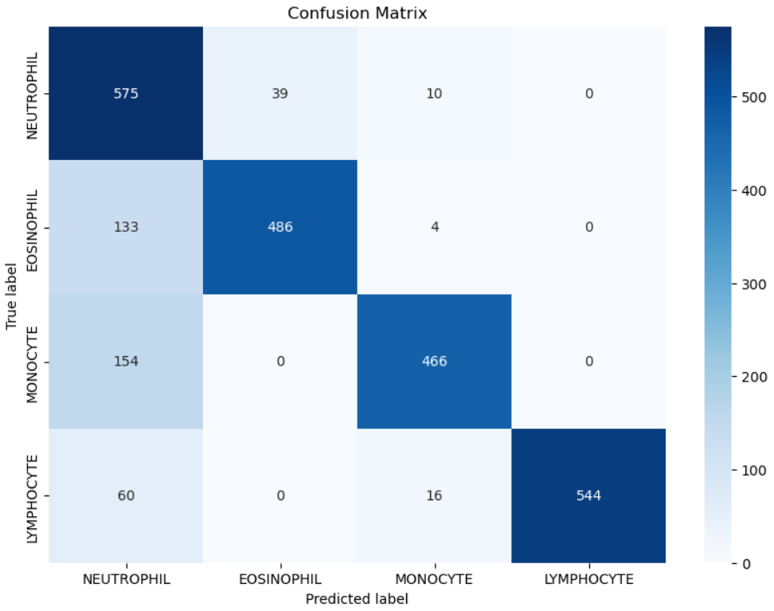
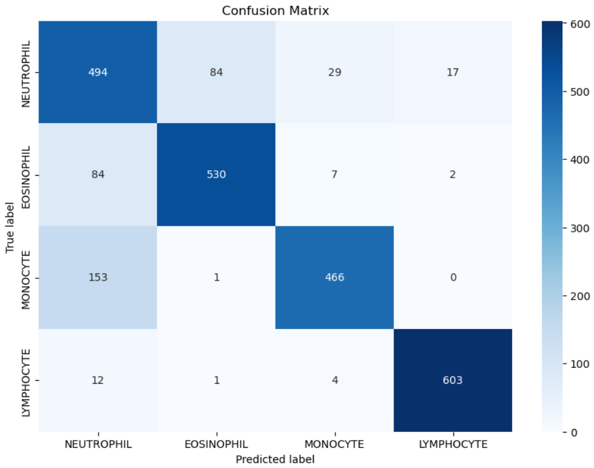

# Blood Cell Classification using Biomedical Image Processing

[](https://www.python.org/)
[](LICENSE)
[](#)

This repository presents a university biomedical engineering project focused on **blood smear microscopy image analysis**. The project explored image processing and machine learning techniques for detecting, counting, and classifying white blood cells from microscopy images.

The current public version contains project documentation, representative visual outputs, confusion matrices, and classification reports. The original source code will be added once recovered.

---

## Project Overview

The objective of this project was to support automated blood cell analysis using biomedical image processing. The available results document two classification tasks:

### 1. Four-class white blood cell classification

- Neutrophil
- Eosinophil
- Monocyte
- Lymphocyte

### 2. Binary classification

- Mononuclear cells
- Polynuclear cells

This project is relevant to biomedical engineering because it addresses automated microscopy image interpretation, a task associated with digital pathology, hematology support systems, and AI-assisted clinical workflows.

---

## Visual Results

### Example Cell Classes



### Preprocessing Example

The available material includes a preprocessing visualization with a blood smear sample and a pixel intensity distribution.



### Detection / Classification Output Example

The project includes visual examples of detected cells and classification outputs.



---

## Results Summary

### Four-Class Classification

Representative experimental runs showed accuracy values around **0.83–0.84** based on the available classification report screenshots.

| Experiment | Accuracy | Macro F1-score | Weighted F1-score | Result files |
|---|---:|---:|---:|---|
| Run 01 | 0.83 | 0.84 | 0.84 | `assets/results/four_class_classification/` |
| Run 02 | 0.84 | 0.84 | 0.84 | `assets/results/four_class_classification/` |

#### Run 01 Confusion Matrix



#### Run 02 Confusion Matrix



### Mononuclear vs Polynuclear Classification

The repository also includes binary classification outputs for mononuclear and polynuclear cells. The available screenshots show representative accuracies around **0.89–0.96**, depending on the experimental run.

Example result folders are available in:

```text
assets/results/binary_mononuclear_polynuclear/
```

---

## Methodology Summary

Based on the available visual evidence, the project workflow can be described as:

1. **Image acquisition**  
   Blood smear microscopy images were used as input data.

2. **Image preprocessing**  
   The available figures suggest the use of image visualization and pixel intensity analysis before segmentation or classification.

3. **Cell localization / region extraction**  
   Output examples show bounding boxes around detected cells or candidate regions.

4. **Classification**  
   Cells were classified into four leukocyte categories and also grouped into mononuclear/polynuclear categories.

5. **Evaluation**  
   Performance was evaluated using accuracy, precision, recall, F1-score, and confusion matrices.

The exact implementation details will be updated once the original Python source file is added.

---

## Repository Structure

```text
.
├── README.md
├── requirements.txt
├── .gitignore
├── LICENSE
├── assets/
│   ├── figures/
│   └── results/
├── data/
│   └── sample_images/
├── docs/
│   ├── methodology.md
│   ├── project_summary.md
│   ├── mext_interview_notes.md
│   └── source_archive_inventory.csv
├── models/
├── notebooks/
└── src/
```

---

## Technical Skills Demonstrated

- Biomedical image processing
- Microscopy image analysis
- Cell detection and classification
- Machine learning model evaluation
- Confusion matrix interpretation
- Python-based scientific computing workflow
- Applied artificial intelligence for healthcare-related data

---

## Current Repository Status

This repository is currently a **documentation and results archive**. To make the project fully reproducible, the following files should be added:

- Original Python source code
- Training and testing scripts
- Dataset source and license information
- Small sample image set, if redistribution is allowed
- Model architecture or algorithm explanation
- Exact dependencies and environment details
- Step-by-step execution instructions

---

## Dataset

The images used in the original project were obtained from a publicly available blood cell image dataset. The dataset source and license should be added here before redistributing original dataset images.

```text
Dataset source: To be added
Dataset license: To be confirmed
```

Users should refer to the original dataset page for usage rights and redistribution conditions.

---

## Future Work

- Add the original Python implementation.
- Create a reproducible training and inference pipeline.
- Add sample input images when permitted by the dataset license.
- Compare classical image processing methods with deep learning models.
- Add explainability visualizations such as saliency maps or class activation maps.
- Package the system as a simple biomedical image analysis demo.

---

## Portfolio Description

**Blood Cell Classification using Biomedical Image Processing**  
University biomedical engineering project focused on automated analysis of blood smear microscopy images. The project explored image preprocessing, cell detection, white blood cell classification, and performance evaluation using confusion matrices and classification metrics.

---

## License and Dataset Notice

This repository is licensed under the MIT License.

The code and documentation in this repository are provided for educational and portfolio purposes. Any microscopy images or datasets used in this project belong to their original sources and are subject to their respective licenses. Please refer to the original dataset page for usage rights and redistribution conditions.
